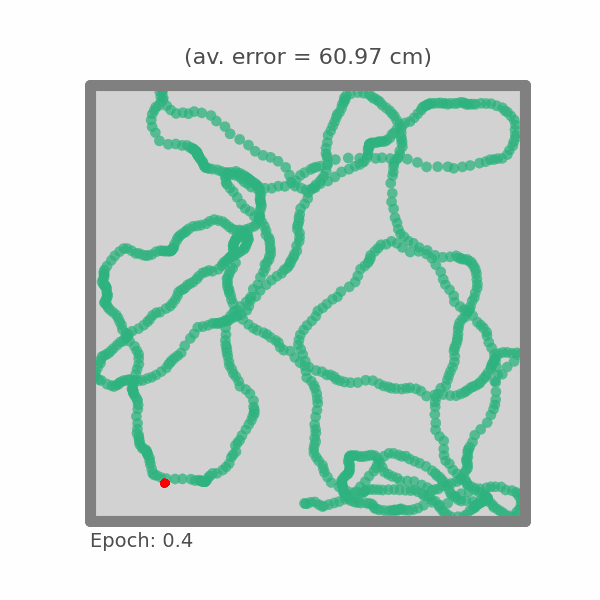

# Deep Learning Tutorial 

In this tutorial ([deeplearning.ipynb](deeplearning.ipynb)) - designed for the TReND CaMinA summer school - we will get hands on building deep neural networks (DNNs) and training them via backproagation. Initially the goal is to **avoid autograd packages** (such as `pytorch` or `jax`) at all costs. Coding a deep neural network by hand this will help us gain an understanding of the mathematics going on behind the scenes. At the end we will use `pytorch` to build a much deeper network and see how it performs. Here's the plan: 

0. **Set-up**: Generate some data for a neuroscience-inspired task our networks will try to learn
1. **Linear regression**: A simple model with an analytic solution. We'll use this as a comparison later on. 
2. **Deep neural networks (by hand)**: Derive analytically the learning rules for a two hidden layer DNN and code this by hand.
3. **Deep neural networks (by `pytorch`)**: Use an autograd package to show how these models can be scaled efficiently.

We recommend cloning and running on your local IDE (it isn't compute heavy and won't require GPUs), but you can also run remotely on Google colab here .